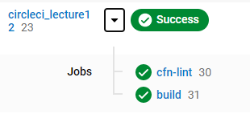
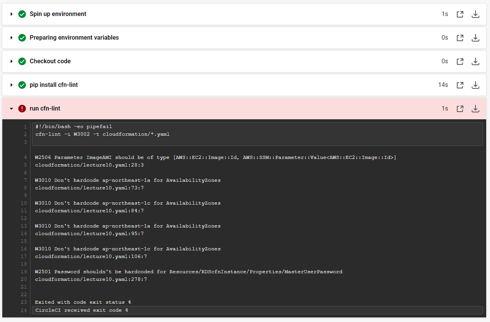

# circleci
circleciの動作testを行うためのリポジトリです。  

## 内容
## １　cloudformationの構文チェック
「cfncheck」ディレクトリ配下にcloudformaton用のyamlファイルを配置し（拡張子は「.yaml」のみです。「.yml」にしたい場合は.circleci/config.ymlを変更してください。）、
  git pushを行うと、cfn-lintがテンプレートの構文チェックをしてくれます。  

## ２　yamlファイルの構文チェック
「yamlcheck」ディレクトリ配下にyamlファイルを配置し（拡張子は「.yaml」のみ）、  
　git pushを行うと、yamllintがyamlファイルの構文チェックをしてくれます。  

※circleciとgithubの事前連携が必要です。  

OK例  
   

NG箇所があった場合のチェック例  
   